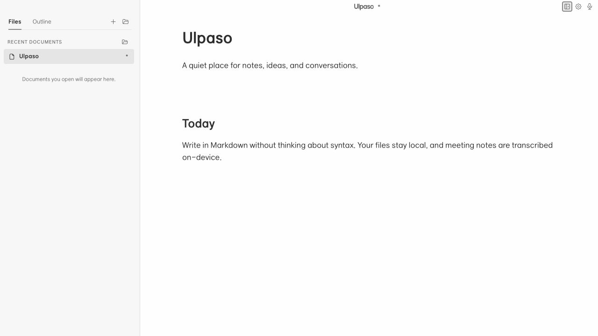

<div align="center">
  <h1>Ulpaso</h1>
  <p><strong>Meetings stay on your Mac.<br />Notes stay in Markdown.</strong></p>
  <p>A quiet, local-first Markdown editor with on-device meeting transcription for macOS.</p>
  <p>
    <a href="https://github.com/bigmacfive/ulpaso/actions/workflows/ci.yml"></a>
    <a href="https://github.com/bigmacfive/ulpaso/releases/latest"></a>
    <a href="https://ulpaso.app/download"></a>
    <a href="LICENSE"></a>
  </p>
  <p>
    <a href="https://ulpaso.app/download"><strong>Download for Mac</strong></a>
    ·
    <a href="https://ulpaso.app/">Website</a>
    ·
    <a href="#build-from-source">Build from source</a>
  </p>
</div>

<p align="center">
  <a href="https://ulpaso.app/">
    
  </a>
</p>

<p align="center"><sub>Apple Silicon · macOS 15+ · no account or subscription required</sub></p>

> [!NOTE]
> Ulpaso is an early preview for Apple Silicon Macs running macOS 15 or later. Current release builds are signed, notarized, and delivered through GitHub Releases with in-app update checks.

## 01 — Your thoughts, on your Mac.

| **Your files** | **Your meetings** | **Your flow** |
| :--- | :--- | :--- |
| Ordinary `.md` files that open anywhere. | Microphone and system audio transcribed on-device. | One quiet place to capture, organize, and keep writing. |

### From conversation to notes

1. **Open a document.** Write in a focused WYSIWYG editor without giving up portable Markdown.
2. **Capture a meeting.** Ulpaso can notice supported calls, ask before recording, and organize local transcription for up to four speakers.
3. **Keep writing.** The transcript lands in the same document as clean, editable notes.

<p align="center">
  
</p>

The editor supports GFM tables, task lists, links, images, blockquotes, lists, and syntax-highlighted code blocks. Draft recovery protects unfinished work, while light and dark themes plus English, Korean, and Japanese interfaces keep the app comfortable for everyday use.

## 02 — Local by design.

Document contents, meeting audio, and transcripts are processed locally and are not sent to Ulpaso servers. Documents remain files you choose on your Mac. There is no account, cloud workspace, proprietary document format, or telemetry pipeline.

- Meeting setup downloads approximately 1.3 GB of pinned speech and speaker models from Hugging Face. Later transcription runs from those local files.
- Temporary recordings are removed after successful completion or cancellation. Recovery audio is retained only when an unexpected stop could otherwise lose the session.
- Meeting detection can suggest starting notes, but recording begins only after you explicitly choose **Start recording**.
- GitHub is contacted for release and update metadata; Hugging Face is contacted for the disclosed model download.

Read [Privacy and data flow](docs/PRIVACY.md) for exact storage paths, network behavior, model sources, and deletion rules.

<details>
<summary><strong>How automatic meeting detection works</strong></summary>

Meeting notifications are enabled by default and can be disabled in Settings. Ulpaso looks for a supported frontmost meeting app—or a matching browser meeting title—while the default microphone is in use. Three consecutive high-confidence checks are required before a native macOS notification appears.

Supported apps include Zoom, Teams, Webex, FaceTime, Skype, and supported browser meetings. Detection does not inspect audio samples, bypass first-use model disclosure, or start recording by itself. Closing the window keeps detection available in the background; quitting with <kbd>⌘ Q</kbd> stops it.

</details>

## 03 — Install.

[**Download the latest signed build →**](https://ulpaso.app/download)

Ulpaso currently requires:

- an Apple Silicon Mac;
- macOS 15 or later.

Download the DMG, move Ulpaso to Applications, and open it normally. Current releases include checksums and a signed, notarized, stapled macOS build.

The editor UI can run in a browser on other platforms, but native saving, system-audio capture, meeting detection, and transcription require the macOS desktop app.

<a id="build-from-source"></a>

## 04 — Build from source.

You will need Xcode command-line tools, Node.js 20.19+ (Node 22 recommended), pnpm 10+, and Rust 1.90.

```sh
corepack enable
pnpm install --frozen-lockfile
pnpm tauri:dev
```

For frontend-only work:

```sh
pnpm dev
```

The development app installs its pinned Python transcription runtime on first use. To assemble the production runtime ahead of an unsigned local build:

```sh
pnpm prepare:asr-runtime
pnpm tauri:build:unsigned
```

Runtime and model downloads are intentionally excluded from Git.

### Verify a checkout

```sh
pnpm check
pnpm build
```

`pnpm check` builds the reusable Markdown package, runs TypeScript and frontend tests, checks Rust formatting, runs Clippy and unit tests, exercises the lightweight Python suite, and validates benchmark manifests. After preparing the model runtime, you can also run:

```sh
pnpm test:python:worker
```

<details>
<summary><strong>Keyboard shortcuts</strong></summary>

| Action | Shortcut |
| --- | --- |
| New document | <kbd>⌘ N</kbd> |
| Open document | <kbd>⌘ O</kbd> |
| Save | <kbd>⌘ S</kbd> |
| Save as | <kbd>⌘ ⇧ S</kbd> |
| Command palette | <kbd>⌘ K</kbd> |
| Settings | <kbd>⌘ ,</kbd> |
| Toggle sidebar | <kbd>⌘ \</kbd> |
| Focus mode | <kbd>⌘ ⇧ F</kbd> |
| Start or stop meeting notes | <kbd>⌘ ⇧ M</kbd> |
| Bold / italic / inline code | <kbd>⌘ B</kbd> / <kbd>⌘ I</kbd> / <kbd>⌘ E</kbd> |
| Strikethrough | <kbd>⌘ ⇧ X</kbd> |

Hover or focus the `?` button in Settings for the complete in-app guide.

</details>

<details>
<summary><strong>Project layout</strong></summary>

```text
src/                         SolidJS editor and interface
packages/markdown/           Markdown ↔ ProseMirror JSON primitives
src-tauri/src/               Rust application and meeting controller
src-tauri/native/            ScreenCaptureKit/CoreAudio bridge
src-tauri/resources/asr/     Local transcription worker and frozen requirements
scripts/                     Runtime, icon, release, and benchmark tooling
benchmarks/                  Model-quality fixtures and aggregate results
docs/                        Architecture, privacy, and contributor documentation
```

</details>

## 05 — Contribute.

Issues and pull requests are welcome. Start with [CONTRIBUTING.md](CONTRIBUTING.md), and report security concerns according to [SECURITY.md](SECURITY.md). Notable changes are tracked in [CHANGELOG.md](CHANGELOG.md).

### Documentation

- [Architecture](docs/ARCHITECTURE.md)
- [Privacy and data flow](docs/PRIVACY.md)
- [Meeting worker protocol](docs/MEETING_PROTOCOL.md)
- [Release and device verification](docs/RELEASE.md)
- [Roadmap](ROADMAP.md)

<div align="center">
  <h2>Start Ulpaso on your Mac.</h2>
  <p><a href="https://ulpaso.app/download"><strong>Download the latest release →</strong></a></p>
</div>

## License

Ulpaso source code is available under the [MIT License](LICENSE). Bundled fonts, adapted editor portions, local inference packages, and downloaded models retain their own licenses; see [Third-party notices](THIRD_PARTY_NOTICES.md).

<details>
<summary><strong>한국어</strong></summary>

Ulpaso는 일반 Markdown 파일을 직접 편집하고 회의 음성을 기기 안에서 전사하는 macOS용 로컬 우선 에디터입니다. Apple Silicon과 macOS 15 이상을 지원하며, 계정·구독·클라우드 문서 형식·텔레메트리 없이 사용할 수 있습니다. 회의 전사 설정 시에는 약 1.3 GB의 고정된 음성·화자 모델을 내려받습니다.

[Mac용 다운로드](https://ulpaso.app/download) · [웹사이트](https://ulpaso.app/) · [개인정보 처리 방식](docs/PRIVACY.md)

</details>
